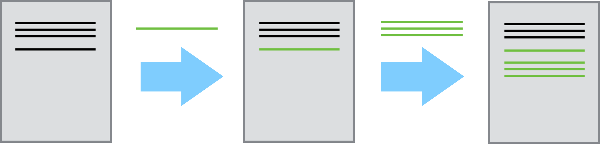

```{r echo=FALSE, message=FALSE}
library(dplyr)
library(ggplot2)
options(show.signif.stars=FALSE)
```

# Reproducibility: who cares?

## Science retracts gay marriage paper without agreement of lead author LaCour

- In May 2015 Science retracted a study of how canvassers can sway 
people's opinions about gay marriage published just 5 months ago.

- Science Editor-in-Chief Marcia McNutt: Original survey data not made 
available for independent reproduction of results. + Survey incentives 
misrepresented. + Sponsorship statement false.

- Two Berkeley grad students who attempted to replicate the study quickly 
discovered that the data must have been faked.

- Methods we'll discuss today can't prevent this, but they can make it 
easier to discover issues.

<font size="3">Source: http://news.sciencemag.org/policy/2015/05/science-retracts-gay-marriage-paper-without-lead-author-s-consent</font>


## Seizure study retracted after authors realize data got "terribly mixed"

From the authors of **Low Dose Lidocaine for Refractory Seizures in 
Preterm Neonates**:

*"The article has been retracted at the request of the authors. After 
carefully re-examining the data presented in the article, they identified 
that data of two different hospitals got terribly mixed. The published 
results cannot be reproduced in accordance with scientific and clinical 
correctness."*

<br><br><br><br>

<font size="3">Source: http://retractionwatch.com/2013/02/01/seizure-study-retracted-after-authors-realize-data-got-terribly-mixed/</font>


## Bad spreadsheet merge kills depression paper, quick fix resurrects it

- The authors informed the journal that the merge of lab results and other 
survey data used in the paper resulted in an error regarding the 
identification codes. Results of the analyses were based on the data set 
in which this error occurred. Further analyses established the results 
reported in this manuscript and interpretation of the data are not correct.

- **Original conclusion:** Lower levels of CSF IL-6 were associated with 
current depression and with future depression [...].

- **Revised conclusion:** Higher levels of CSF IL-6 and IL-8 were 
associated with current depression [...].

<font size="3">Source: http://retractionwatch.com/2014/07/01/bad-spreadsheet-merge-kills-depression-paper-quick-fix-resurrects-it/</font>


## Divorce study felled by a coding error gets a second chance

- **Original conclusion:** The risk of divorce in a heterosexual marriage increases when the wife falls ill, but not the husband. 

- **Corrected conclusion:** Based on the corrected analysis, we conclude that there are not gender differences in the relationship between gender, pooled illness onset, and divorce.

<br><br><br><br>

<font size="3">Source: http://retractionwatch.com/2015/09/10/divorce-study-felled-by-a-coding-error-gets-a-second-chance/#more-32151</font>

## Divorce study retraction: Editor's note

- "The research environment is fast-paced given the ethos to “publish or perish"."

- "[...] research is becoming increasingly complex, with greater calls for transdisciplinary collaborations, “big data,” and more sophisticated research questions and methods [...] data sets often have multiple files that require merging, change the wording of questions over time, provide incomplete codebooks, and have unclear and sometimes duplicative variables."

- "Given these issues, I would not be surprised if coding errors were fairly common, and that the ones discovered constitute only the "tip of the iceberg."

<br><br>

<font size="3">Source: http://retractionwatch.com/2015/09/10/divorce-study-felled-by-a-coding-error-gets-a-second-chance/#more-32151</font>


# Reproducibility: why should you care?

## Think back to every time...

>- The results in Table 1 don't seem to correspond to those in Figure 2.
>- In what order do I run these scripts?
>- Where did we get this data file?
>- Why did I omit those samples?
>- How did I make that figure?
>- "Your script is now giving an error."
>- "The attached is similar to the code we used."

<br><br>

<font size="3">Source: Karl Broman</font>

## 

<br><br><br><br>

Your closest collaborator is you six months ago, <br>
but you don’t reply to emails.
<br><br>
<font size="3">- Mark Holder</font>

<br><br><br>

# Reproducibility: how?

## Reproducibility checklist

- Are the tables and figures reproducible from the code and data?
- Does the code actually do what you think it does?
- In addition to what was done, is it clear *why* it was done? (e.g., how 
were parameter settings chosen?)
- Can the code be used for other data?
- Can you extend the code to do other things?

## Ambitious goal + many other concerns 

We need an environment where

- data, analysis, and results are tightly connected, or better yet, 
inseparable

- reproducibility is built in
    + the original data remains untouched
    + all data manipulations and analyses are inherently documented

- documentation is human readable and syntax is minimal


## Toolkit

<center>

</center>


## Outline

1. Scriptability $\rightarrow$ R

2. Literate programming $\rightarrow$ R Markdown

3. Version control $\rightarrow$ Git / GitHub

4. Other considerations


# 1. Scriptability

## Point-and-click vs. scripting

- Learning curve: Point-and-click software (supposedly) have shallower learning curves than scripting languages

- Documentation: At a minimum, your code documents your analysis
    + And you can do better with comments and README files

- Automation: Need to rerun your analysis with new/updated data? Just change the input file.

- Collaboration: Sharing your analysis is as easy as sharing your scripts

## Why R?

<div class="columns-2">
- Programming language for data analysis
- Free!
- Open source
- Widely used and supported across all disciplines
- Can be used on Windows, Mac OS X, or Linux


</div>


## Why not language X?

- There are a number of other great programming tools out there that can also be 
used to improve the reproducibility of your analysis

- The key is to use some type of language that will allow you to automate and 
document your analysis

- Once you master one language you'll probably find it easier to learn another


## Once in R

<div class="columns-2">
You could just type into the command prompt...

- ... but that doesn't help much with documentation

- ... but that doesn't help much with automation


</div>


## 2. Literate programming

## Donald Knuth "Literate Programming (1983)"

"Let us change our traditional attitude to the construction of programs: 
Instead of imagining that our main task is to instruct a *computer* what 
to do, let us concentrate rather on explaining to *human beings* what we 
want a computer to do."

"The practitioner of literate programming [...] strives for a program that 
is comprehensible because its concepts have been introduced in an order 
that is best for human understanding, using a mixture of formal and 
informal methods that reinforce each other."

- These ideas have been around for years!
- and tools for putting them to practice have also been around
- but they have never been as accessible as the current tools


## A better solution than just R

With RStudio you can combine your programming and your documentation

<div class="columns-2">
- RStudio gives you a single environment to combine your documentation and your
analysis
- It runs on top of R
- Gives you a bunch of really cool features that we'll explore throughout the
workshop


</div>

## Anatomy of RStudio

<div class="columns-2">
- Left: Console
    - Text on top at launch: version of R that you’re running
    - Below that is the prompt
- Upper right: Workspace and command history
- Lower right: Plots, access to files, help, packages, data viewer


</div>

## What is Markdown?

- Markdown is a lightweight markup language for creating HTML (or XHTML) 
documents.

- Markup languages are designed to produce documents from human readable 
text (and annotations).

- Some of you may be familiar with LaTeX. This is another (less human 
friendly) markup language for creating pdf documents.

- Why I love Markdown:
    + Simple syntax means easy to learn and use.
    + Focus on **content**, rather than **coding** and debugging 
    **errors**.
    + Allows for easy web authoring.
    + Once you have the basics down, you can get fancy and add HTML,
    JavaScript, and CSS.

## What is R Markdown?

Well, it's R + Markdown

- Ease of Markdown syntax

- Rendering of R code to produce output and plots

## R Markdown: syntax


## R Markdown: code


## Example: Big Five Personality Test

```{r}
big5 <- read.delim("raw-data/big5.txt") %>%
  tbl_df() # for formatting
```

## View data {.smaller}
```{r}
big5
```

## Clean data

You can include script files in your R Markdown document:

```{r message=FALSE}
source("code/01-data-cleanup.R")
```

## View distribution of age {.smaller}

```{r message=FALSE, fig.height=3}
ggplot(big5, aes(x = age)) +
  geom_histogram()
```

```{r}
summary(big5$age)
```

## Regress extraversion vs. neuroticism and gender {.smaller}

**Extraversion:** Seeking fulfillment from sources outside the self or in community. High scorers are social, low scorers prefer to work alone. **Neuroticism:** Being emotional.

```{r message=FALSE}
m_ext_age <- lm(extraversion ~ neuroticism * gender, data = big5)
summary(m_ext_age)
```

## Plot extraversion vs. age and gender {.smaller}

```{r message=FALSE, fig.height=4}
ggplot(data = big5, aes(x = neuroticism, y = extraversion, color = gender)) +
  geom_point(alpha = 0.5) +
  geom_jitter() +
  geom_smooth(method = "lm")
```

## Suppose you want only teens {.smaller}

```{r}
big5_teen <- filter(big5, age <= 19)
```

```{r}
m_ext_age_teen <- lm(extraversion ~ age * gender, data = big5_teen)
summary(m_ext_age_teen)
```

## Plot for only teens {.smaller}

```{r message=FALSE}
ggplot(data = big5_teen, aes(x = neuroticism, y = extraversion, color = gender)) +
  geom_point(alpha = 0.5) +
  geom_jitter() +
  geom_smooth(method = "lm")
```

# 3. Version control

## What is version control?

Version control is a system that records changes to a file or set of files over time so that you can recall specific versions later.

## Bad

<center>

</center>

<font size="3">Source: Piled Higher and Deeper by Jorge Cham, http://www.phdcomics.com.</font>


## Good

~~~
    2013-10-14_manuscriptFish.doc
    2013-10-30_manuscriptFish.doc
    2013-11-05_manusctiptFish_intitialRyanEdits.doc
    2013-11-10_manuscriptFish.doc
    2013-11-11_manuscriptFish.doc
    2013-11-15_manuscriptFish.doc
    2013-11-30_manuscriptFish.doc
    2013-12-01_manuscriptFish.doc
    2013-12-02_manuscriptFish_PNASsubmitted.doc
    2014-01-03_manuscriptFish_PLOSsubmitted.doc
    2014-02-15_manuscriptFish_PLOSrevision.doc
    2014-03-14_manuscriptFish_PLOSpublished.doc
~~~


## Better - Saving everything together at once

Everytime you make a save, you zip the entire directory that your project files are in and save it with a date.


## Best - Version Control

<center>

</center>

<br><br><br>

<font size="3">From Code for RNeXML R package, plus RNeXML publication in RMarkdown, [https://github.com/ropensci/RNeXML](https://github.com/ropensci/RNeXML).</font>

## How does a version control system work?

## 

- Version control systems start with a base version of the document and then save just
the changes you made at each step of the way.

- You can think of it as a tape: if you rewind the tape and start at the base document, then you can play back each change and end up with your latest version.

<center>

</center>

<br><br>

From [Software Carpentry](https://software-carpentry.org/).


## 

- You can then think about "playing back" different sets of changes onto the base document and getting different versions of the document.

<center>

</center>

<br><br>

From [Software Carpentry](https://software-carpentry.org/).


## Git for version control

- Makes you fearless
- Easy to set up
- Allows you to take a snapshot of every stage of your project history
- Takes up minimal space
- Creates a easy navigatable map to the history of all changes made

- Integrated with RStudio

## Features of using a Hosting Service Like Github

- Backup of your project
- No need for a server: easy to set up
- GitHub's strong community: your colleagues are probably already there
- Provides tools to help enhance collaboration
- A common location to share your work


# Parting remarks

## Parting remarks

- Everyone struggles with reproducibility and it is a hindrance to moving 
science forward

- Evan with a fairly simple analysis challenges were faced in four main areas:
organization, documentation, automation, and dissemination

- Over the two day workshop, data analysis tasks will become more complex as we 
gather more data and ask more complicated questions, so we need better tools and 
workflows to combat issues arising in these areas

## Two-pronged approach

<div class="columns-2">
\#1 
Adopt a reproducible research workflow

<br><br>

\#2
Train new researchers who don’t have any other workflow


</div>
